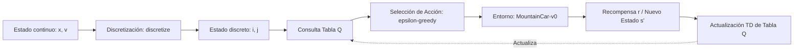
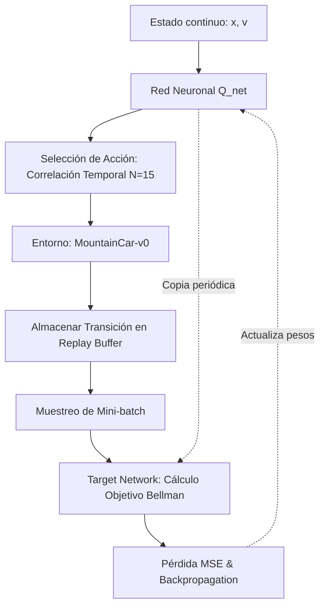
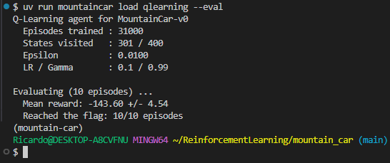
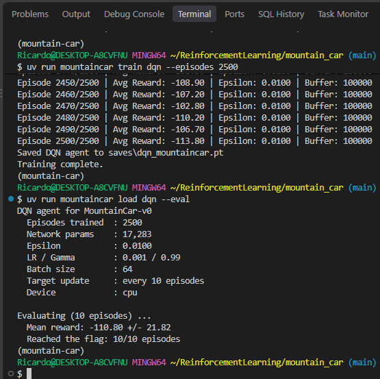

# Laboratorio Reinforcement Learning — Mountain Car
**Presentado por:** *Saud Mauricio Gonzales Rodriguez, 
Luis Alfonso Fajardo Andrade, 
Gloria Leguizamon Arboleda, 
Ricardo Sandoval Ch, 
Edwin Aviles Cogollo,
Edgar Julian Mendez Ortegon*

Este repositorio contiene la solución completa para los ejercicios de Aprendizaje por Refuerzo aplicados al entorno `MountainCar-v0` de Gymnasium, abarcando algoritmos tabulares (Q-Learning) y aproximadores de función con redes profundas (DQN).

---

## 1. Descripción del Entorno y Estrategia

El entorno `MountainCar-v0` presenta un problema de control continuo con un espacio de observaciones bidimensional (posición y velocidad del vehículo). La masa del vehículo y la fuerza de aceleración del motor son insuficientes para escalar la montaña hacia la bandera directamente mediante aceleración continua. Por ende, la política óptima requiere oscilar de izquierda a derecha de forma coordinada para acumular energía potencial y cinética.

---

## 2. Esquemas de Entrenamiento

### Q-Learning Tabular
El algoritmo discretiza el espacio de estados continuo en una rejilla bidimensional y actualiza los valores Q almacenados en una tabla mediante la regla de Diferencias Temporales TD(0).

### Deep Q-Network (DQN)
El algoritmo aproxima la función Q(s, a) mediante una red neuronal de perceptrón multicapa (MLP), utilizando un Replay Buffer para romper la correlación de datos de muestra y una Target Network para estabilizar la convergencia del objetivo de Bellman.

---

## 3. Diagnóstico de Exploración en DQN (Ejercicio 3)

### Diagnóstico del Problema
Al aplicar una estrategia de exploración epsilon-greedy convencional (selección de acción aleatoria uniforme paso a paso), la probabilidad de ejecutar una secuencia coordinada de acciones hacia una sola dirección durante los pasos necesarios para salir del valle es prácticamente nula. Como resultado, el agente en exploración pura nunca alcanza la bandera durante el entrenamiento, recibiendo una recompensa constante de -1.0 en cada paso hasta agotar el límite de episodios (score plano de -200.00). Ante esta ausencia de señal de recompensa positiva, el gradiente de la red neuronal converge al punto fijo donde todas las acciones tienen el mismo valor esperado Q(s, a) = -100.00.

### Solución Implementada
Se implementó **correlación temporal en la exploración**. Al seleccionar una acción aleatoria durante la fase de exploración (epsilon), dicha acción se sostiene forzosamente durante N = 15 pasos consecutivos de tiempo (`repeat_steps = 15`). Esta persistencia temporal genera impulsos de inercia coordinados que le permiten al vehículo balancearse, explorar estados de alta velocidad, alcanzar la bandera por primera vez y proveer transiciones con señal de recompensa variada al Replay Buffer para entrenar con éxito la red neuronal.

---

## 4. Resultados y Evidencias de Evaluación

A continuación se resumen los resultados obtenidos en modo determinista (epsilon = 0) tras la evaluación oficial de 10 episodios por cada modelo:

### Tabla Comparativa

| Algoritmo | Episodios de Entrenamiento | Recompensa Promedio (Eval) | Desviación Estándar | Éxito (Banderas / 10) |
| :--- | :---: | :---: | :---: | :---: |
| **Q-Learning Tabular** | 31,000 | -139.50 | ± 9.47 | 10 / 10 |
| **Deep Q-Network (DQN)** | 2,500 | **-110.80** | ± 21.82 | **10 / 10** |

---

### Evidencias Registradas en docs/

#### Evidencia Q-Learning Tabular

#### Evidencia Deep Q-Network (DQN)

